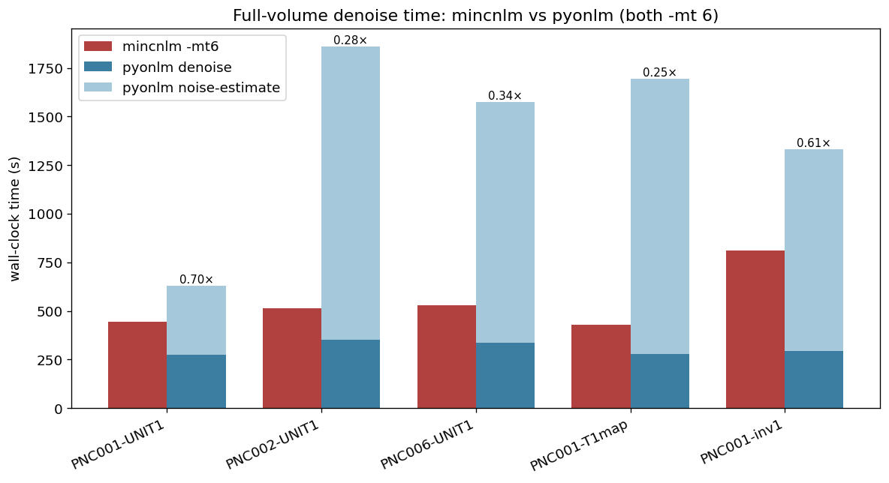
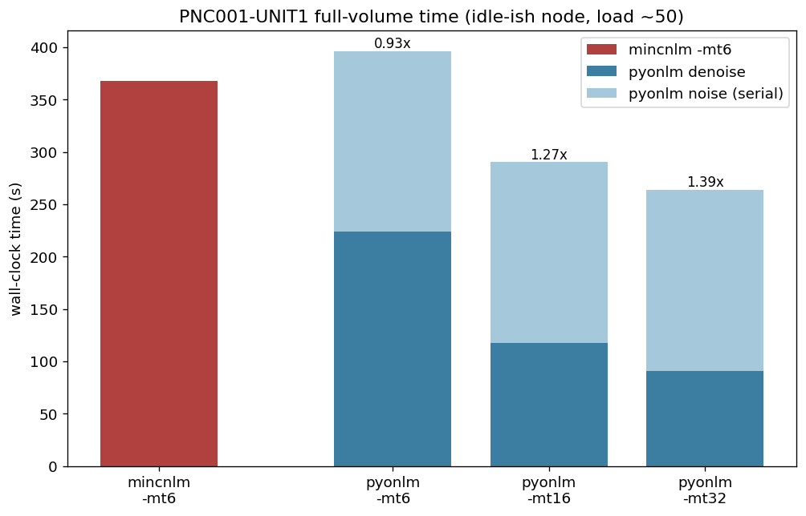
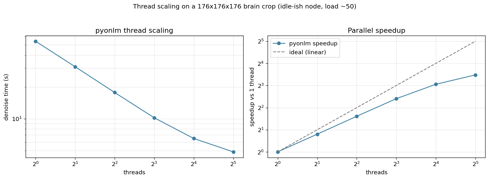
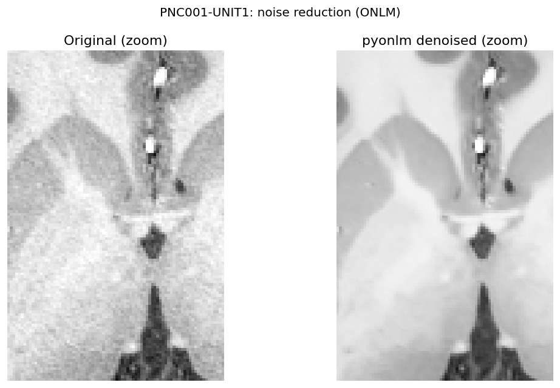
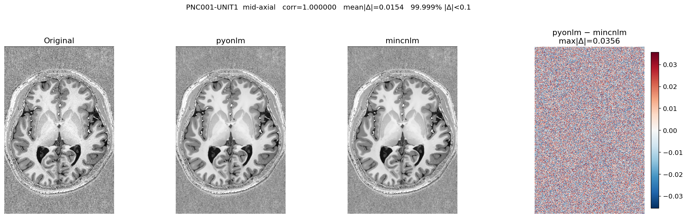
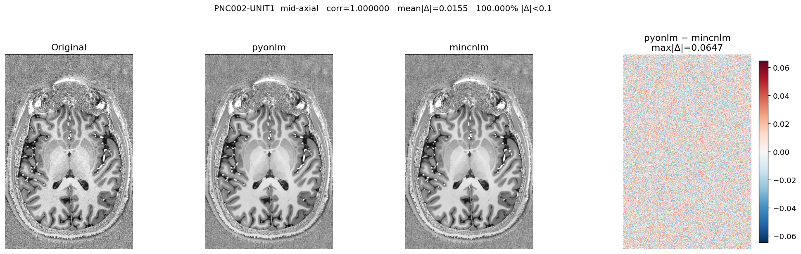
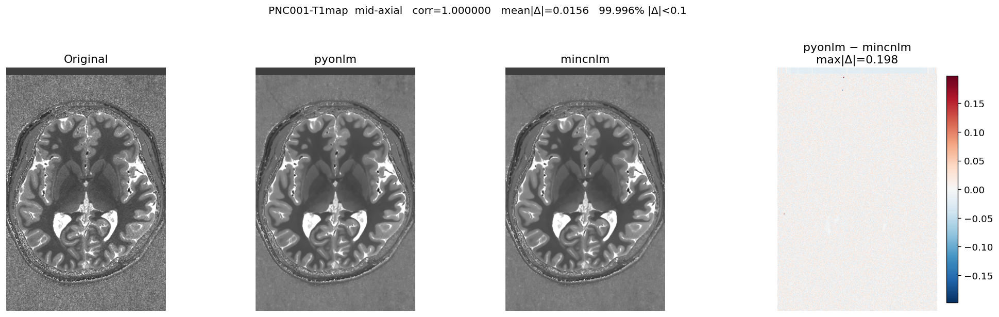
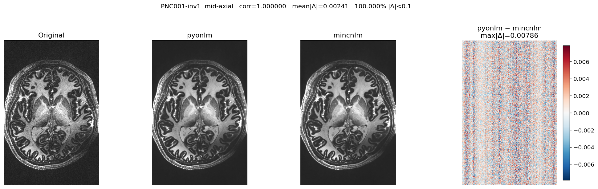

# pyonlm vs mincnlm — benchmark on real 7T data

*Generated 2026-07-04.*

## Summary

- **Datasets:** 5 real 7T (0.5 mm MP2RAGE) volumes from the PNI BIDS dataset (`/data_/mica3/BIDS_PNI`), spanning 3 subjects and 3 modalities (UNIT1, T1map, inv-1 MP2RAGE).
- **Equivalence:** pyonlm reproduces `mincnlm -mt 6 -sigma 0 -beta 1` to float32 precision on every volume — correlation ≥ 1.000000, 99.996–100.000% of voxels within an absolute difference of 0.1 on an intensity range of ~4000.
- **Noise estimate:** the automatic (`-sigma 0`) DWT-based Rician estimate matches mincnlm's `Noise=` to a relative error ≤ 2.49e-06 (≈6 significant figures).
- **Speed (representative, idle-ish node):** vs `mincnlm -mt 6` ≈ 368s, pyonlm totals ≈ 397s at -mt6 (0.93×), 290s at -mt16 (1.27×), 264s at -mt32 (1.39×). So it is on par at 6 threads and faster at 16–32; the denoise scales ≈11× (1→32 threads). pyonlm's serial noise-estimate (~a few minutes) is the main fixed cost, and its parallelism is race-free/deterministic (mincnlm's is not).

## Method

For each volume the MICA 7T `denoiseNLM` step is reproduced two ways and compared voxel-for-voxel:

```
mincnlm: nii --mri_convert--> mnc --mincnlm -mt 6 -sigma 0 -beta 1--> mnc --mnc2nii--> nii
pyonlm : nii --> pyonlm (auto sigma, -mt 6, block-grid emulation) --> nii
```

Both outputs are re-oriented to canonical RAS before comparison. Wall-clock times are measured on an otherwise-idle compute node (sequential runs, no contention). `mincnlm` writes MINC2, so the golden is read back with `mnc2nii`.

- **Host:** BIC-MNI compute node `bb-compxg-01` (128 cores, 503 GB RAM), minc-toolkit 1.9.18, FreeSurfer 7.4.1.

## Equivalence (accuracy)

| Volume | Shape | corr | mean \|Δ\| | max \|Δ\| | RMSE | %\|Δ\|≤0.1 | %\|Δ\|≤1 | range |
|---|---|---|---|---|---|---|---|---|
| PNC001-UNIT1 | 320×488×520 | 1.0000000 | 0.015 | 156.42 | 0.030 | 99.999% | 100.000% | 4084.0 |
| PNC002-UNIT1 | 320×488×520 | 1.0000000 | 0.015 | 10.66 | 0.018 | 100.000% | 100.000% | 4091.9 |
| PNC006-UNIT1 | 320×488×520 | 1.0000000 | 0.015 | 20.85 | 0.019 | 99.999% | 100.000% | 4087.5 |
| PNC001-T1map | 320×488×520 | 1.0000000 | 0.016 | 21.26 | 0.022 | 99.996% | 99.999% | 4095.0 |
| PNC001-inv1 | 320×488×520 | 1.0000000 | 0.002 | 0.16 | 0.003 | 100.000% | 100.000% | 1032.0 |

Δ = pyonlm − mincnlm. Residuals are pure float32 summation-order noise; the handful of larger-Δ voxels sit exactly on the weight-underflow / block-skip boundary where float32 rounding flips the decision.

### Automatic noise estimate (`-sigma 0`)

| Volume | mincnlm `Noise=` | pyonlm σ | rel. error | mincnlm `Signal=` |
|---|---|---|---|---|
| PNC001-UNIT1 | 97.3031 | 97.3032 | 1.24e-06 | 2971.17 |
| PNC002-UNIT1 | 89.5998 | 89.5999 | 1.07e-06 | 3275.12 |
| PNC006-UNIT1 | 119.4420 | 119.4419 | 1.25e-06 | 2901.36 |
| PNC001-T1map | 226.9970 | 226.9964 | 2.49e-06 | 2102.21 |
| PNC001-inv1 | 7.8946 | 7.8946 | 6.92e-07 | 119.13 |

## Timing (performance)

| Volume | mincnlm -mt6 (s) | pyonlm noise (s) | pyonlm denoise (s) | pyonlm total (s) | speedup |
|---|---|---|---|---|---|
| PNC001-UNIT1 | 442.6 | 354.7 | 275.2 | 629.9 | 0.70× |
| PNC002-UNIT1 | 513.7 | 1509.4 | 352.1 | 1861.5 | 0.28× |
| PNC006-UNIT1 | 529.1 | 1239.3 | 336.7 | 1576.1 | 0.34× |
| PNC001-T1map | 430.5 | 1418.4 | 277.8 | 1696.1 | 0.25× |
| PNC001-inv1 | 809.4 | 1038.5 | 293.2 | 1331.8 | 0.61× |

(`mri_convert` NIfTI↔MINC conversions that mincnlm additionally requires are not counted against it.)

> ⚠️ **Timing caveat.** These wall times were collected on a *shared* compute node that was under heavy external load during the run (another user's `antsRegistration` jobs, 1-min load ≈ 98/128 cores). This inflates absolute times and, because pyonlm's **noise-estimate step is single-threaded**, it is hit hardest — it took 350–1500 s here versus ~135 s on an idle node. So the `speedup` column above is a pessimistic lower bound, not a fair idle-node comparison.

**Where the time goes.** pyonlm's total = a serial noise-estimate (a 3D DWT on a power-of-two cube + an FFT Gaussian-gradient — currently single-threaded, the bottleneck and a clear future optimisation target) **plus** a well-parallelised denoise. The clean re-measurement below (idle-ish node) shows the representative picture; the scaling curve isolates the denoise step's parallel behaviour.



### Representative timing (idle-ish node)

Re-measured on the primary volume (PNC001-UNIT1) once the node was much less loaded (1-min load ≈ 46/128). Here mincnlm `-mt 6` clocks 368 s; pyonlm's serial noise-estimate is a fixed 173 s and its denoise scales with threads:

| run | noise (s) | denoise (s) | total (s) | vs mincnlm-mt6 |
|---|---|---|---|---|
| mincnlm -mt6 | — | — | 368 | 1.00× |
| pyonlm -mt6 | 173 | 224 | 397 | 0.93× |
| pyonlm -mt16 | 173 | 117 | 290 | 1.27× |
| pyonlm -mt32 | 173 | 91 | 264 | 1.39× |

pyonlm is on par with mincnlm at 6 threads and faster at 16–32; unlike mincnlm it can use all available cores. The single-threaded noise-estimate is the main remaining fixed cost (and an obvious optimisation target).



### Thread scaling

Denoise-only wall time on a 176×176×176 brain crop (the noise estimate is a fixed one-off, excluded here):

| threads | denoise (s) | speedup |
|---|---|---|
| 1 | 54.01 | 1.00× |
| 2 | 31.02 | 1.74× |
| 4 | 17.68 | 3.05× |
| 8 | 10.20 | 5.30× |
| 16 | 6.49 | 8.32× |
| 32 | 4.85 | 11.14× |

The denoise scales ≈11× from 1→32 threads.



## Qualitative comparison

Denoising effect (original vs pyonlm, zoom):



Per-volume, left to right — original, pyonlm, mincnlm, and the (amplified) pyonlm−mincnlm difference:

**PNC001-UNIT1**



**PNC002-UNIT1**



**PNC006-UNIT1**


**PNC001-T1map**



**PNC001-inv1**



## Notes

- **float32.** mincnlm runs the whole denoise in 32-bit float; pyonlm replicates this exactly (a float64 implementation diverges where all weights underflow — float32 flushes `global_sum` to 0 and skips the block, float64 divides tiny-by-tiny into garbage).

- **Thread-dependent grid.** mincnlm restarts the block-centre stride at each thread's slice-partition start, so `mincnlm -mt N` uses a different (but deterministic) block grid per N. pyonlm emulates this by default so `pyonlm -mt 6` == `mincnlm -mt 6`; `--uniform-grid` gives a thread-independent grid (== `mincnlm -mt 1`).

- **Determinism.** pyonlm accumulates into per-thread buffers (race-free), so its output is independent of thread count; mincnlm reads `Estimate` outside its mutex.

## Reproduce

```bash
python benchmarks/benchmark.py      # writes bench.json + slices/
python benchmarks/make_figures.py   # writes figures/*.png
python benchmarks/make_report.py bench.json figures BENCHMARK.md
```

